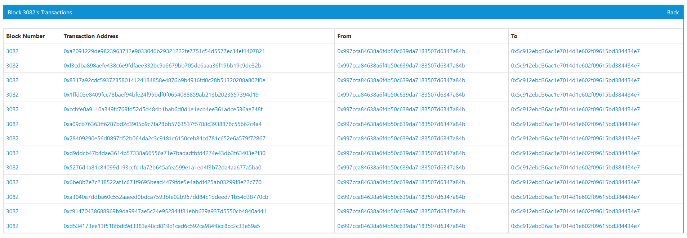

# Ethereum-explorer

This is a simple explorer for [ethereum](https://www.ethereum.org/) blockchain.

## Dependencies

- [Spring Boot](http://projects.spring.io/spring-boot/)
- [lombok](http://projects.spring.io/spring-boot/)
- [web3j](https://github.com/web3j/web3j)
- [thymeleaf](http://www.thymeleaf.org/)
- [Amaze UI](http://amazeui.org/)

## Build

1. modify project properties `application.yml`. Only one available node will be applied.

   ```yaml
   eth:
     peers:
       - node rpc address
       - node rpc address
   ```


2. build

   ```shell
   mvnw package
   ```

3. run.

   ```shell
   java -jar explorer-0.0.1-SNAPSHOT.jar
   ```

4. browse http://localhost:8080

## Examples



